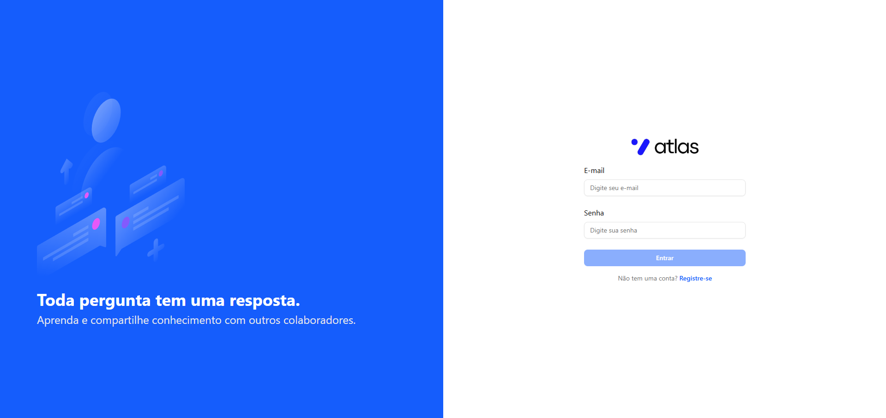
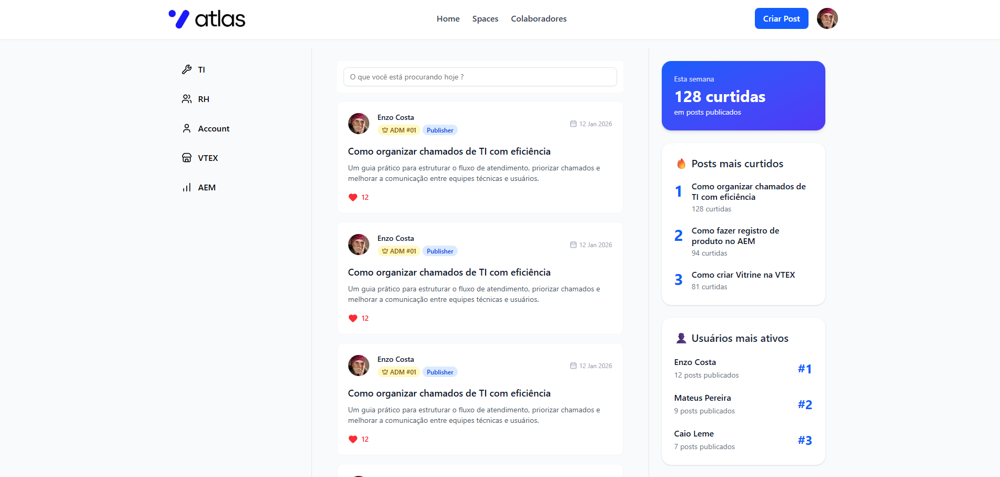
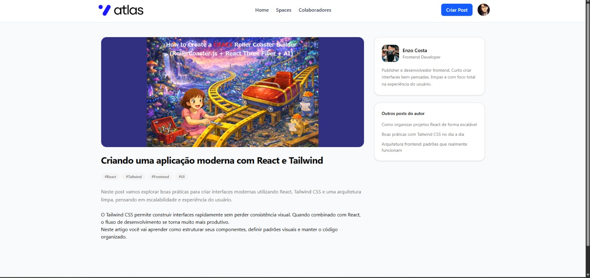
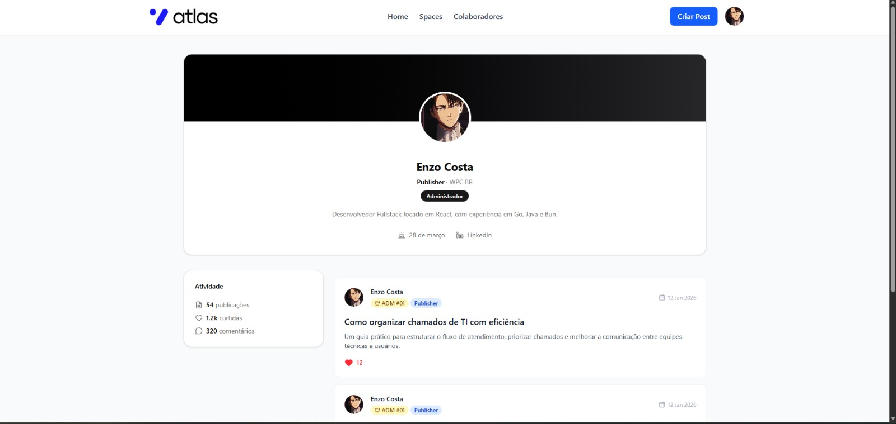

<p align="center">
  
</p>

<p align="center">
   <strong>Sistema corporativo para gestão e compartilhamento de conhecimento organizacional.</strong>
</p>

<p align="center">
  
  
  
  
</p>

<p align="center">
 <a href="#-sobre-o-projeto">Sobre</a> •
 <a href="#-layout">Layout</a> • 
 <a href="#-tecnologias-utilizadas">Tecnologias</a> • 
 <a href="#-instalação-e-uso">Instalação</a> • 
</p>

<h4 align="center"> 
	🚧  Projeto em Desenvolvimento 🚧
</h4>

## 💻 Sobre o projeto

Este projeto foi criado com o objetivo de servir como um espaço centralizado para o compartilhamento de conhecimento entre diferentes setores da empresa. A proposta é facilitar a troca de informações, documentações, boas práticas e aprendizados, promovendo mais alinhamento, eficiência e colaboração entre as equipes.

A aplicação permite organizar conteúdos por áreas, tornando o acesso às informações mais rápido e estruturado, além de incentivar a padronização de processos e a disseminação do conhecimento técnico e institucional.

## 🖼️ Layout

### 🔐 Tela de Login
<p align="center">
  
</p>

---

### 🏠 Tela Home
<p align="center">
  
</p>

---

### 📝 Tela de Posts
<p align="center">
  
</p>

---

### 👤 Tela de Perfil
<p align="center">
  
</p>


## 🔨 Tecnologias utilizadas

As seguintes ferramentas foram usadas na construção do projeto:

- **[ReactJS](https://reactjs.org/)**
- **[TypeScript](https://www.typescriptlang.org/)**
- **[Shadcn UI](https://ui.shadcn.com/)**
- **[Vite](https://vitejs.dev/)**
- **[Biome](https://biomejs.dev/pt-br/)**
- **[react-hook-form](https://react-hook-form.com/)**
- **[phosphor-icons](https://phosphoricons.com/)**
- **[axios](https://axios-http.com/ptbr/)**

> Veja o arquivo [package.json](https://github.com/EnzoXavier1001/atlas-web/blob/prod/package.json)

## 🚀 Instalação e uso

```bash
# Clone o repositório
git clone https://github.com/EnzoXavier1001/atlas-web.git

# Acesse a pasta do projeto
cd atlas-web

# Instale as dependências
pnpm install

# Execute a aplicação
pnpm run dev

# O servidor inciará na porta:5173 - acesse http://localhost:5173/
```


